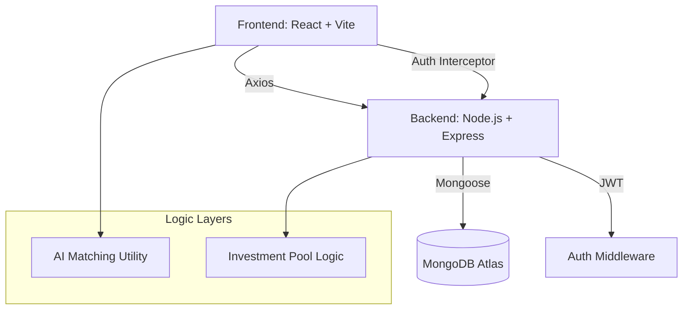

# Smart Franchise Locator 🚀

A full-stack MERN application that helps investors find the perfect franchise opportunities using an **AI-driven Matching Engine**. 


## 🌟 Key Features

### 1. **AI Matching Engine**
- Calculates a personalized **Match Score** (0-100%) for every franchise based on the investor's budget, land availability, and city preferences.
- Dynamic color-coding (Green/Amber/Red) helps users quickly identify high-potential investments.

### 2. **Dual-Role Dashboards**
- **Investor Portal**: Browse franchises, track applications, find co-investment partners, and view AI-matched recommendations.
- **Brand Portal**: List new franchise opportunities, manage incoming applications, and track brand expansion.

### 3. **Co-Investment Pools**
- Allows smaller investors to join "pools" for high-capital franchises, enabling collaborative investment.

### 4. **Interactive Financial Tools**
- Real-time **ROI Calculator** on franchise detail pages.
- Visual mapping of franchises using **Leaflet.js**.

---

## 🏗 Architecture



---

## 🛠 Tech Stack

- **Frontend**: React (Hooks, Context), Vite, Bootstrap 5, Axios, React Router, Leaflet.
- **Backend**: Node.js, Express.js.
- **Database**: MongoDB (Mongoose ODM).
- **Authentication**: JSON Web Tokens (JWT) & BcryptJS.
- **Tools**: VS Code, MongoDB Compass, Git.

---

## 🚀 Getting Started

### Prerequisites
- Node.js (v16+)
- MongoDB (Running locally or on Atlas)

### Setup

1. **Clone the Repo**
   ```bash
   git clone [repository-url]
   cd Smart-Franchise-Locator
   ```

2. **Backend Configuration**
   - Navigate to `/backend`
   - Create a `.env` file:
     ```env
     PORT=5000
     MONGODB_URI=mongodb://localhost:27017/franchise-db
     JWT_SECRET=your_super_secret_key
     ```
   - Install and Start:
     ```bash
     npm install
     npm run dev
     ```

3. **Frontend Configuration**
   - Navigate to `/frontend`
   - Install and Start:
     ```bash
     npm install
     npm run dev
     ```

---

## 👨‍💻 Author
Aditya Srivastava
Full-Stack Developer | MERN Enthusiast

---

*Note: This project was built to demonstrate full-stack integration, role-based access control, and intelligent data processing in a real-world business scenario.*
